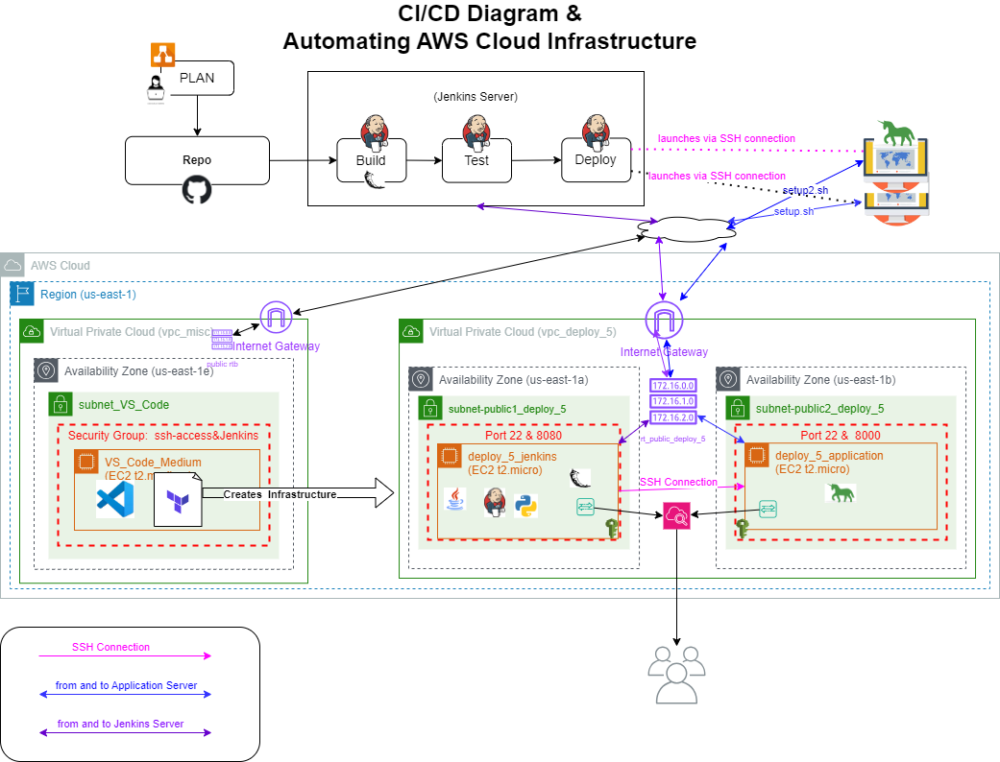
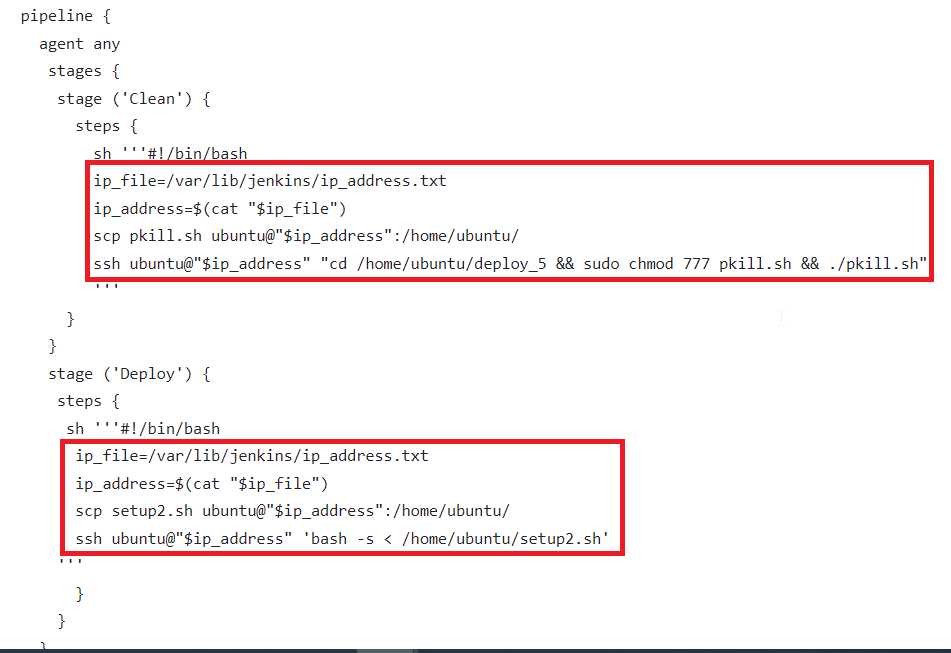
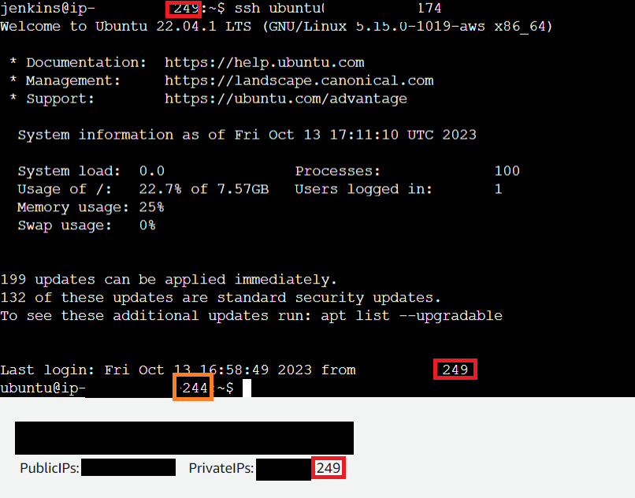
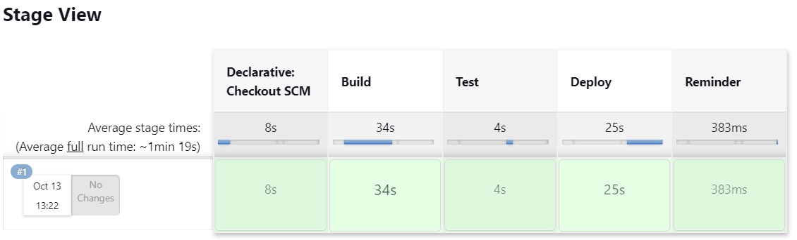
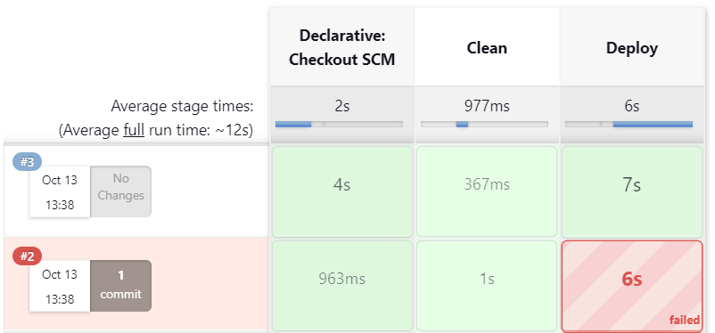
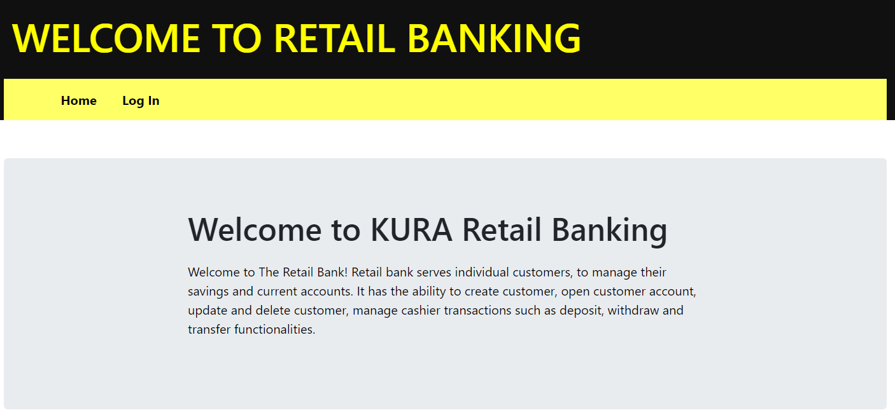

# Run a Jenkins Build for a Banking Application and Deploy it to a second instance using SSH

October 13, 2023

By:  Annie V Lam - Kura Labs

# Purpose

SSH to another different server to deploy the application 

Previously, we manually built the infrastructure that built, tested, and deployed our URL application in one server.  In this deployment, we used Terraform to create the infrustructure.  However, we are building and testing the application in one server.  Then, sshing into the second server to deploy the application. 

## Step #1 Diagram the VPC Infrastructure and the CI/CD Pipeline



## Step #2 GitHub/Git

GitHub serves as the repository from which Jenkins retrieves files to build, test, and deploy the URL Shortener application.  For this deployment, we need to make edits to the Jenkinsfilev1 "Deploy" block to:  secure copy the file "setup.sh" from the Jenkins Server to the Application Server, ssh to the Application server, and run the "setup.sh" script.  Also, update the setup.sh file to clone the repository from https://github.com/LamAnnieV/deploy_5.git and cd to the correct directory where the local repository is located.  
After successfully deploying the application, edit the Jenkinsfilev2 "Deploy" block to:  secure copy the file "setup2.sh" from the Jenkins Server to the Application Server, ssh to the Application server, and run the "setup2.sh" script.  Then, update the setup2.sh file to: clone the repository from https://github.com/LamAnnieV/deploy_5.git, delete the correct previous repository,  cd to correct directory that contains your newly cloned local repository.  Also, update a HTML file for testing purposes.

**Edit to the Jenkinsfilev1**


**Edit to the setup.sh**


**Edit to the Jenkinsfilev2**



**Edit to the setup2.sh**


**Edit to a HTML file**


In order for the EC2 instance, where Jenkins is installed, to access the repository, you need to generate a token from GitHub and then provide it to the EC2 instance.

[Generate GitHub Token](https://github.com/LamAnnieV/GitHub/blob/main/Generate_GitHub_Token.md)

## Step #3 Automate the Building of the Application Infrastructure 

For this application infrastructure, we want:  

```
1 VPC
2 Availability Zones
2 Public Subnets
2 EC2 Instances
1 Route Table
2 Security Group 
  -one with ports: 22 and 8000
  -another with ports: 22 and 8080
```

To automate the building of the application infrastructure, use an instance that has vs code and terraform.  In the [terraform main.tf file](Images/main.tf), resources can be created by defining the resources you want terraform to create.  In addition, terraform allows the running of scripts for installs.  For one of the instance, a [script](Images/instance_1_installs.sh) was used for the installation of Jenkins.

**Jenkins**

Jenkins is used to automate the Build, Test, and Deploy the Banking Application.  To use Jenkins in a new EC2, all the proper installs to use Jenkins and to read the programming language that the application is written in need to be installed. In this case, they are Jenkins, Java, and Jenkins additional plugin "Pipeline Keep Running Step", which is manually installed through the GUI interface.


## Step #4 Establish a SSH Connection from the Jenkins Server to the Application Server

Though the Jenkins Server initiates the deployment of the application, it does not deploy it.  It SSH to the application server and runs a script to deploy the application. 
 To do so, an SSH connection needs to be established as a Jenkins User.  
 
**Command to establish SSH Connection as Jenkins user: **

```
#In the Jenkins Server run the following bash commands
sudo passwd jenkins
sudo su - jenkins -s /bin/bash
ssh-keygen  #This will generate the public key to /var/lib/jenkins/.ssh/id_rsa.pub
#Copy the public key from the file id_rsa.pub
#Paste the key in /home/ubuntu/.ssh/authorized_keys file
#Then in the Jenkins server as a Jenkins user, run the command below to test the SSH connection
ssh ubuntu@application_server_ip_address
```




## Step #5 Other Installation

In both instances, as an ubuntu user, install the following:

'''
sudo apt update

sudo apt install -y software-properties-common 

sudo add-apt-repository -y ppa:deadsnakes/ppa 

sudo apt install -y python3.7 

sudo apt install -y python3.7-venv

'''

## Step #6 Configure Jenkins Build and Run Build

**"deploy_5" Build**

[Create Jenkins Multibranch Pipeline Build](https://github.com/LamAnnieV/Jenkins/blob/main/Jenkins_Multibranch_Pipeline_Build.md)

Jenkins Build:  In Jenkins create a build "deploy_5" for the Banking application from GitHub Repository [https://github.com/LamAnnieV/deployment_4.git](https://github.com/LamAnnieV/deploy_5.git) and run the build.  This build consists of four stages:  The Build, the Test, the Clean, and the Deploy stages.

Please refer back to "Edit to the Jenkinsfilev1" and "Edit to the setup.sh" above for changes.

**Result**

Jenkins build "deploy_5" was successful:




**"deploy_5" Build**

Jenkins build "deploy_5" was successful:

Please refer back to "Edit to the Jenkinsfilev2" and "Edit to the setup2.sh" above for changes.

**Result**

Jenkins build "deploy_5.1" took multiple attempts before the build was successful:





**Issue(s)**


## Conclusion


  
## Area(s) for Optimization:

-  Automate the AWS Cloud Infrastructure using Terraform modules

Note:  ChatGPT was used to enhance the quality and clarity of this documentation
  
